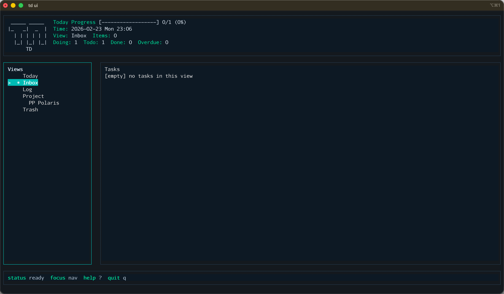

# td

`td` 是一个本地优先的终端 Todo 工具，支持 CLI 和单页 TUI。
**目标**：做最好用的终端 Todo + Ai 应用，帮助用户高效管理任务。

## 功能概览

- 任务生命周期：`inbox -> todo -> doing -> done -> deleted`
- CLI：新增、编辑、标记、删除、恢复、清空、项目管理、截止时间
- TUI：单页双栏视图（Today / Inbox / Log / Project / Trash）
- 剪贴板创建：`--clip`
- AI 解析创建：`--clip --ai`（失败自动回退规则解析）
- 本地存储：SQLite（默认 `~/.td/data/td.db`）
- 自升级：从 GitHub Releases 检测并升级

## 安装

### 方式 1：下载 Release 二进制（推荐）

在 [Releases](https://github.com/roobtyan/td/releases) 下载对应平台文件：

- `td-darwin-amd64`（macOS Intel）
- `td-darwin-arm64`（macOS Apple Silicon）
- `td-linux-amd64`（Linux x86_64）
- `td-linux-arm64`（Linux ARM64）

示例（macOS Apple Silicon）：

```bash
chmod +x td-darwin-arm64
sudo mv td-darwin-arm64 /usr/local/bin/td
td version
```

### 方式 2：源码运行

```bash
go test ./... -count=1
go run ./cmd/td --help
```

## 快速开始

```bash
td add "buy milk"
td add "prepare slides" -p work --due "2026-02-25 18:00"
td ls
td ls today
td done 1
td reopen 1
td rm 1
td restore 1
td ui
```

## CLI 命令

```bash
td add <text> [--project|-p] [--priority|-P] [--due]
td ls [today]
td show <id>
td edit <id> <title>
td done <id...>
td reopen <id...>
td today <id...>
td due <id> <datetime> [--clear]
td rm <id...>
td restore <id...>
td purge <id...>
td project ls|add|rename|rm ...
td ui
td version
td upgrade [--check]
```

### `due` 输入格式

`add --due` 与 `due` 命令支持以下格式：

- `YYYY-MM-DD`
- `YYYY-MM-DD HH:MM`
- `YYYY-MM-DDTHH:MM`
- `YYYYMMDDHHMM`（例如：`202602051122`）
- RFC3339

### `ls` 说明

- `td ls`：默认不显示 `deleted` 任务
- `td ls today`：按 today 规则筛选
- 输出列：`id / status / title / project / due`

## TUI 使用

启动：

```bash
td ui
```

界面预览：



退出：按 `q`

常用快捷键：

- `j/k` 上下移动
- `Tab` 切换焦点（导航/任务）
- `Enter` 选择视图或项目
- `a` 新建任务
- `e` 编辑标题
- `x` 删除
- `c` 标记 done
- `t` 在 `doing` 与 `todo` 之间切换
- `P` 设置项目
- `d` 设置截止时间
- `z` 撤销最近删除
- `?` 打开帮助

Trash 视图专用：

- `r` 恢复选中任务
- `X` 清空垃圾桶

## 自升级

```bash
td upgrade --check
td upgrade
```

### 升级常见问题

1. 代理导致超时（`context deadline exceeded`）

```bash
export HTTP_PROXY=http://127.0.0.1:7890
export HTTPS_PROXY=http://127.0.0.1:7890
td upgrade --check
td upgrade
```

2. 无权限覆盖 `/usr/local/bin/td`

```bash
sudo -E td upgrade
```

`-E` 用于保留代理环境变量。

## 配置与数据目录

- 默认目录：`$HOME/.td`
- 可通过环境变量 `TD_HOME` 覆盖
- 数据库：`$TD_HOME/data/td.db`

## 开发

```bash
go test ./... -count=1
go build -o bin/td ./cmd/td
```

注入版本信息构建：

```bash
go build -ldflags "\
  -X td/internal/buildinfo.Version=v0.3.1 \
  -X td/internal/buildinfo.Commit=$(git rev-parse --short HEAD) \
  -X td/internal/buildinfo.Date=$(date -u +%Y-%m-%dT%H:%M:%SZ)" \
  -o bin/td ./cmd/td
```
